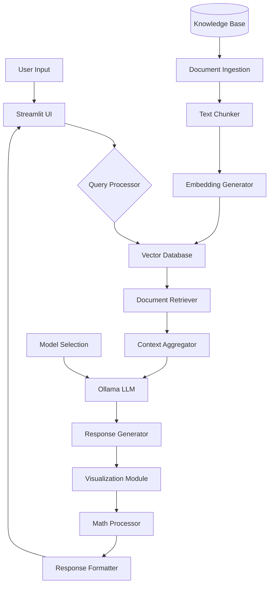

# Advanced RAG Application for Wireless Cellular Communications - Design Document

## 1. Overview

This document outlines the design for an advanced Retrieval-Augmented Generation (RAG) application focused on wireless cellular communications. The application serves as an interactive learning and reference tool, capable of answering questions, explaining topics, and visualizing concepts related to cellular communications.

## 2. System Architecture

The application is built using the following components:

1. **LangChain**: For orchestrating the RAG pipeline and managing interactions between components.
2. **Ollama**: To run language models locally, with the flexibility to switch between different models.
3. **Streamlit**: For creating the user interface and deploying the application.
4. **Vector Database**: To store and efficiently retrieve embeddings of the knowledge base.
5. **Document Loader and Processor**: To ingest and process various document formats.
6. **Plotting Library**: For generating visualizations and diagrams.

## 3. Key Features

- Knowledge Base Integration
- Advanced Question Answering
- Beginner-Friendly Explanations
- Visualization Capabilities
- Mathematical Explanations
- Model Flexibility
- Interactive User Interface

## 4. Detailed Component Design

### 4.1 Document Ingestion and Processing
- Use LangChain's document loaders for various file formats (PDF, TXT, HTML).
- Implement custom parsers for 3GPP specifications to extract structured information.
- Use LangChain's text splitters to create coherent chunks of information.

### 4.2 Vector Database
- Utilize FAISS or Chroma as the vector store.
- Implement efficient indexing and retrieval mechanisms.

### 4.3 Retrieval System
- Develop a hybrid retrieval system combining keyword search and semantic similarity.
- Implement re-ranking of retrieved documents based on relevance.

### 4.4 Language Model Integration
- Use Ollama to run models like Llama 2 or GPT-J locally.
- Implement a flexible model selection mechanism in the UI.

### 4.5 Response Generation
- Use retrieved context to generate responses with the language model.
- Implement a fact-checking mechanism to ensure accuracy.

### 4.6 Visualization Module
- Integrate Matplotlib or Plotly for generating plots and charts.
- Develop a custom module for creating flow charts and diagrams.

### 4.7 Math Processing
- Implement a LaTeX rendering system for displaying equations.
- Develop an algorithm to simplify and explain mathematical concepts step-by-step.

## 5. User Interface Design

### 5.1 Main Components
- Query input box
- Response display area
- Visualization panel
- Model selection dropdown
- Conversation history sidebar

### 5.2 Features
- Real-time response generation
- Interactive visualizations
- Option to view source documents
- Conversation export functionality

## 6. Design Flow Diagram

The following diagram illustrates the high-level architecture and data flow of the RAG application:

This diagram shows the main components of the system and how data flows between them:

1. User input is received through the Streamlit UI.
2. The query processor handles the input and interacts with the vector database.
3. Relevant documents are retrieved and aggregated.
4. The Ollama LLM generates a response based on the retrieved context.
5. The response is enhanced with visualizations and mathematical explanations as needed.
6. The formatted response is sent back to the UI for display.
7. In parallel, the knowledge base is processed, embedded, and stored in the vector database.

## 7. Development Roadmap

1. Set up the basic project structure with LangChain, Ollama, and Streamlit.
2. Implement document ingestion and vector database creation.
3. Develop the core RAG pipeline.
4. Create the visualization and math explanation modules.
5. Design and implement the user interface.
6. Integrate all components and perform initial testing.
7. Deploy the application and gather user feedback.
8. Iterate and enhance based on feedback.

This design document provides a comprehensive overview of the Advanced RAG Application for Wireless Cellular Communications, outlining its architecture, components, and development plan.
